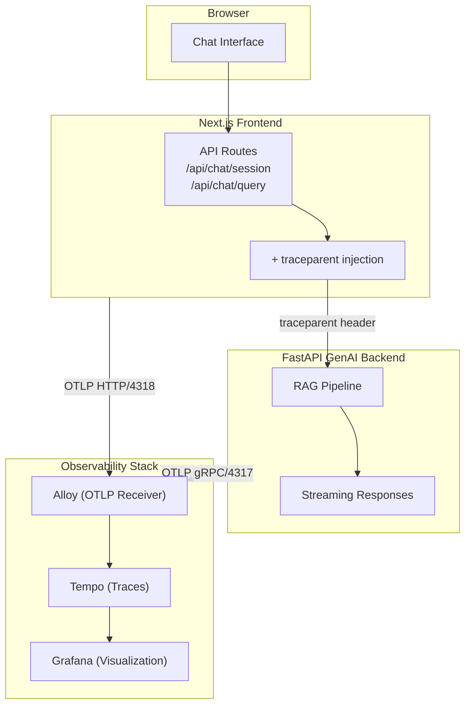

<a id="readme-top"></a>

<!-- PROJECT LOGO & TITLE -->

<div align="center">
  <a href="https://github.com/opencloudhub">
  <picture>
    <source media="(prefers-color-scheme: light)" srcset="https://raw.githubusercontent.com/opencloudhub/.github/main/assets/brand/assets/logos/primary-logo-light.svg">
    <source media="(prefers-color-scheme: dark)" srcset="https://raw.githubusercontent.com/opencloudhub/.github/main/assets/brand/assets/logos/primary-logo-dark.svg">
    <!-- Fallback -->
    
  </picture>
  </a>

<h1 align="center">Demo App Frontend</h1>

<p align="center">
    Next.js chat interface demonstrating distributed tracing across frontend and backend services.<br />
    <a href="https://github.com/opencloudhub"><strong>Explore OpenCloudHub »</strong></a>
  </p>
</div>

---

<details>
  <summary>📑 Table of Contents</summary>
  <ol>
    <li><a href="#about">About</a></li>
    <li><a href="#features">Features</a></li>
    <li><a href="#architecture">Architecture</a></li>
    <li><a href="#getting-started">Getting Started</a></li>
    <li><a href="#configuration">Configuration</a></li>
    <li><a href="#observability">Observability</a></li>
    <li><a href="#future-improvements">Future Improvements</a></li>
    <li><a href="#license">License</a></li>
  </ol>
</details>

---

<h2 id="about">🎯 About</h2>

A simple Next.js chat application that demonstrates **end-to-end distributed tracing** in a Kubernetes environment. This frontend connects to the [demo-app-genai-backend](https://github.com/OpenCloudHub/demo-app-genai-backend) RAG service and showcases how to establish observability across multiple services.

This is a **demo application** built to showcase:

- 🔗 **Distributed Tracing**: Trace context propagation from frontend → backend
- 🌊 **Streaming Responses**: Server-Sent Events (SSE) for real-time chat
- 📊 **Full Stack Observability**: Integration with Grafana, Tempo, and the k8s-monitoring stack
- 🚀 **Production Deployment**: Dockerized Next.js with Kubernetes manifests

---

<h2 id="features">✨ Features</h2>

- **Chat Interface**: Clean UI with shadcn/ui components
- **Session Management**: Multiple chat sessions with history
- **Streaming Responses**: Real-time token streaming via SSE
- **OpenTelemetry Integration**: Automatic instrumentation with `@vercel/otel`
- **Trace Propagation**: `traceparent` header injection for distributed traces
- **Dark Theme**: Styled to match OpenCloudHub branding

---

<h2 id="architecture">🏗️ Architecture</h2>



**Trace Correlation**: A single user query generates a unified trace showing:

- Frontend API route processing
- HTTP request to backend
- Backend RAG pipeline execution
- LLM inference time

---

<h2 id="getting-started">🚀 Getting Started</h2>

### Prerequisites

- Node.js 22+ with pnpm
- Access to demo-app-genai-backend
- OTLP collector (Alloy) for tracing

### Quick Start

1. **Clone and install**

```bash
git clone https://github.com/OpenCloudHub/demo-app-frontend.git
cd demo-app-frontend
pnpm install
```

2. **Configure environment**

```bash
cp .env.example .env.local
```

```env
NEXT_PUBLIC_API_URL=https://demo-app.opencloudhub.org/api
OTEL_EXPORTER_OTLP_ENDPOINT=http://localhost:4318
```

3. **Port-forward services** (if using minikube)

```bash
# OTLP collector
kubectl port-forward -n observability svc/k8s-monitoring-alloy-receiver 4318:4318
```

4. **Run development server**

```bash
pnpm dev
```

5. **Open** [http://localhost:3000](http://localhost:3000)

---

<h2 id="configuration">⚙️ Configuration</h2>

| Variable                      | Description        | Default                     |
| ----------------------------- | ------------------ | --------------------------- |
| `NEXT_PUBLIC_API_URL`         | Backend API URL    | `http://localhost:8000/api` |
| `OTEL_EXPORTER_OTLP_ENDPOINT` | OTLP HTTP endpoint | `http://localhost:4318`     |

### In-Cluster Configuration

For Kubernetes deployment, use service DNS:

```bash
NEXT_PUBLIC_API_URL=http://demo-app-genai-backend.demo-app.svc.cluster.local:8000/api
OTEL_EXPORTER_OTLP_ENDPOINT=http://k8s-monitoring-alloy-receiver.observability.svc.cluster.local:4318
```

---

<h2 id="observability">📊 Observability</h2>

### Viewing Traces in Grafana

1. Open Grafana → **Explore** → Select **Tempo**
2. Query by service: `{resource.service.name="demo-app-frontend"}`
3. Click a trace to see the full distributed trace across services

### Example Trace

```text
demo-app-frontend POST /api/chat/query (4.18s)
├── resolve page components (11ms)
├── executing api route /api/chat/query (8ms)
└── fetch POST .../api/query (4.08s)
    └── demo-app-genai-backend POST /query (4.07s)
        ├── retrieve documents (120ms)
        └── llm generation (3.9s)
```

---

<h2 id="future-improvements">🔮 Future Improvements</h2>

This demo establishes basic distributed tracing. Potential enhancements include:

| Enhancement                | Description                                                   |
| -------------------------- | ------------------------------------------------------------- |
| **Traces → Logs**          | Correlate traces with application logs in Loki via `trace_id` |
| **Logs → Traces**          | Click-through from log entries to full trace view             |
| **Metrics with Exemplars** | Link Prometheus metrics to specific traces                    |
| **Real User Monitoring**   | Browser-side tracing with OpenTelemetry JS SDK                |
| **Error Tracking**         | Capture and correlate frontend errors with backend traces     |

See the [Grafana correlation docs](https://grafana.com/docs/grafana/latest/explore/correlations/) for implementation details.

---

<h2 id="license">📄 License</h2>

Distributed under the Apache 2.0 License. See [LICENSE](LICENSE) for more information.

---

<div align="center">
  <h3>🌟 Part of OpenCloudHub</h3>
  <p><em>Demonstrating production-ready MLOps practices</em></p>

  <div>
    <a href="https://github.com/OpenCloudHub/demo-app-genai-backend">
      
    </a>
    <a href="https://opencloudhub.github.io/docs">
      
    </a>
  </div>
</div>

<p align="right">(<a href="#readme-top">back to top</a>)</p>
